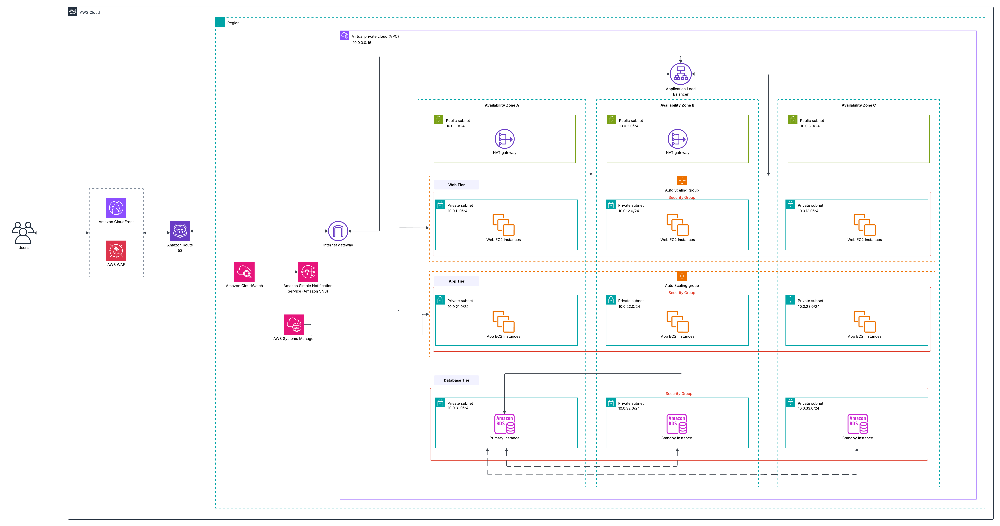

# <h1 align="center">Scalable 3-Tier Web Application on AWS</h1>
<h3 align="center">AWS Solutions Architect – Associate Project</h3>

---

## Project Overview

This project is a setup of a highly available and scalable web application built on AWS. 

It uses a traditional 3-tier layout (Web, Application, and Database) spread across **three Availability Zones (AZ A, AZ B, and AZ C)** inside a custom network (VPC). The goal is to make sure the app stays online even if a server or an entire data center goes down, while keeping all sensitive parts securely hidden from the public internet.

---

## Architecture Diagram

Here is the full system design:

---

## How the Application Works

### 1. User Requests & Security at the Edge
* **Route 53:** Translates the website name to direct user traffic into the system.
* **CloudFront:** Caches static files like pictures and stylesheets so pages load faster for users.
* **AWS WAF:** Sits in front to filter out malicious web traffic and common attacks like SQL injection.

---

### 2. Network Layout (VPC & Subnets)
The network runs inside a Virtual Private Cloud (VPC) with the IP range `10.0.0.0/16`. It is split into **Public** subnets and **Private** subnets across 3 Availability Zones:

* **Public Subnets (`10.0.1.0/24`, `10.0.2.0/24`, `10.0.3.0/24`):** Connected to the Internet Gateway. Holds the load balancer and NAT Gateways.
* **Web Private Subnets (`10.0.11.0/24`, `10.0.12.0/24`, `10.0.13.0/24`):** Holds the web servers. No direct public internet access.
* **App Private Subnets (`10.0.21.0/24`, `10.0.22.0/24`, `10.0.23.0/24`):** Holds the application logic servers.
* **Database Private Subnets (`10.0.31.0/24`, `10.0.32.0/24`, `10.0.33.0/24`):** Completely isolated for database storage.

#### A Note on NAT Gateways & Cost
To save on costs while maintaining high availability:
* NAT Gateways are placed in **Public Subnets AZ A and AZ B**.
* Private servers in AZ A and AZ B use their local NAT Gateway to download updates from the internet.
* Private servers in **AZ C share the NAT Gateway in AZ A or AZ B**.
* *Why?* Running a 3rd NAT Gateway in AZ C adds extra monthly charges. Using two NAT Gateways across three zones is enough to keep things running reliably without paying for unnecessary extras.

---

### 3. Compute & Scaling Tiers

#### Application Load Balancer (ALB)
Sits in the public subnets. It takes incoming user traffic from the internet and passes it down to the web servers. It constantly checks server health so users aren't sent to a broken instance.

#### Web Tier & App Tier (Auto Scaling Groups)
* Web servers handle page rendering, while App servers handle business logic and database queries.
* Both layers sit in private subnets behind **Auto Scaling Groups (ASG)**. If traffic spikes, AWS automatically spins up more servers. If traffic drops, it removes them to save money.

---

### 4. Database Tier (Amazon RDS Multi-AZ)

* Runs a relational database (MySQL/PostgreSQL) setup across multiple zones.
* **Primary Database (AZ A):** Handles all app reads and writes.
* **Standby Databases (AZ B & AZ C):** Continuously copy data from the primary database. If AZ A fails, AWS automatically switches over to one of the standby databases so the site stays up.

---

### 5. Security & Management

#### Security Groups (Firewall Rules)
Access is locked down layer by layer:
1. The **ALB** accepts traffic from the web.
2. **Web Servers** only accept traffic from the ALB.
3. **App Servers** only accept traffic from the Web Servers.
4. The **Database** only accepts traffic from the App Servers.

#### Systems Manager (Session Manager)
There are no public SSH ports or bastion hosts. Remote access to private instances is managed securely through **AWS Systems Manager Session Manager**.

---

### 6. Monitoring & Alerts

* **Amazon CloudWatch:** Tracks CPU usage, server health, and traffic spikes.
* **Amazon SNS:** Connects to CloudWatch alarms to send notifications if something breaks or when auto-scaling triggers.

---

## Key AWS Services Used

* **VPC & Internet Gateway:** Custom network and internet access.
* **CloudFront & Route 53:** Content delivery and DNS management.
* **AWS WAF:** Firewall protection against web attacks.
* **EC2 & Auto Scaling:** Virtual servers that scale up and down automatically.
* **Application Load Balancer:** Distributes traffic evenly to servers.
* **NAT Gateways:** Let private servers pull updates securely.
* **RDS Multi-AZ:** High-availability database with automated failover.
* **Systems Manager:** Secure server access without opening SSH ports.
* **CloudWatch & SNS:** Monitoring and alarm notifications.
